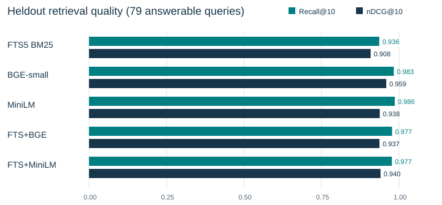

# Reproducible Retrieval Evaluation

## A Workbench for Lexical, Semantic, and Hybrid Search

Nathan John Chandrasekar

[ORCID 0009-0003-9702-8164](https://orcid.org/0009-0003-9702-8164)

Technical report accompanying proposed software version 1.0.0. Release candidate for review.

### Abstract

I built a standalone workbench to compare retrieval methods under explicit, inspectable conditions. It joins versioned synthetic fixtures, lexical and local semantic retrieval, result-contract checking, compatible-run comparison, and static reporting. I compare SQLite FTS5 BM25, BGE-small-en-v1.5, all-MiniLM-L6-v2, and two reciprocal-rank-fusion combinations over 300 records and 188 queries. The release re-evaluates the established configuration on both known query splits, without tuning or changing record-level labels. On the 79 answerable queries in the original held-out split, BGE obtains nDCG@10 of 0.9588 and recall@10 of 0.9831; MiniLM obtains 0.9379 and 0.9863. Lexical recall is 0.9363. A repeated execution preserves all quality aggregates, while timing varies materially. All methods return candidates for each of the fifteen unanswerable queries. I interpret the results as a reproducible comparison on this small synthetic corpus, not an answerability test or a general model ranking.

### Motivation and contribution

Retrieval comparisons are difficult to interpret when candidate eligibility, text truncation, relevance labels, or failure handling change between methods. A plausible ranked list can conceal an ineligible record, incomplete evidence, or an execution that never occurred. I make those conditions visible alongside retrieval scores.

The contribution is the evaluation software and documented comparison. I do not propose a new ranking algorithm. The workbench preserves complete fixture records, exposes passage offsets, checks observations against explicit contracts, and refuses misleading comparisons across incompatible inputs. A future retrieval implementation can supply observations through the same adapter boundary.

The release is source-first research software for the tested Windows CPython 3.13 x64 environment. It includes reusable code, synthetic fixtures, pinned acquisition recipes, tests, new raw observations, and this report. The public evidence supports the numerical results directly; acquisition and inference require no private repository or hosted model service.

<!-- pagebreak -->

## 1. Corpus, labels, and applicability

The corpus contains thirty synthetic story families with ten records each. The 188 queries are divided into 94 development and 94 original held-out queries, from fifteen families per split. Each split contains 79 answerable queries and fifteen requests with empty relevance sets. Every retrieval run indexes the complete corpus. The original split withheld query scoring and relevance use during configuration selection; it did not withhold documents from indexing.

OpenAI Codex generated the stories, identifiers, code references, records, queries, and labels. They do not represent a real project corpus. A second model-assisted reviewer inspected twenty queries against their records and rules before the original full comparison, ten per split, without retrieval scores. That bounded review identified two missing grade-1 illustrations: an Orchard rain-rule trial and a Tide boarding-deadline observation. The labels and rationales were corrected from the text before scoring. There was no human annotation study or exhaustive independent relevance assessment.

### What a relevance label means

Grade 3 directly answers a query or an independently requested component. Grade 2 supplies an explicit partial answer or corroboration. Grade 1 supplies useful illustration or context without establishing the answer. An omitted record is nonrelevant or ineligible under the declared rules. Labels are attached to record IDs, not to embedding neighborhoods. Each query includes a reviewable rationale and explicit applicability rules.

Ordinary queries search one of six synthetic workspaces containing five related projects and their authors. Other queries constrain project, task, owner, status, epistemic state, revision, or source availability. Eligibility is computed before ranking. The fictional shared owner and verified status describe story-world judgments; successful filtering does not establish authenticated access control.

### Coverage and candidate pools

The records include decisions, preferences, observations, unsupported hypotheses, same-name entities, and old/current disagreements. There are 253 current, 29 superseded, seven disputed, two revoked, and nine deleted records. The nine deleted bodies are null, leaving 291 indexable records. Thirty questions request multiple records. Six questions target trial observations; six target evidence in the last paragraph of bodies longer than 1,000 characters.

Across queries, eligible pools have minimum, median, and maximum sizes of 1, 36, and 43. Fifty of 158 answerable queries have at most ten eligible records, 25 in each split. Their recall@10 can be easy. I retain every query in the main analysis and separately describe the larger-pool subset. Story structure and scenario types recur across splits, so family separation does not make this an independently blinded benchmark.

Only title and body enter searchable text. IDs, labels, rationales, family assignments, and rules remain evaluator metadata. Fixture audits check broken references, exact body hashes, duplicate cases, contradictory eligibility, supersession cycles, and declared split leakage. They cannot certify semantic independence or factual truth.

<!-- pagebreak -->

## 2. Retrieval methods and metrics

### Shared retrieval contract

Each method builds an experimental index from the same records, searches a supplied eligible-ID set, and fetches the full canonical fixture record for every returned hit. Search results are deduplicated at record level. Ties are resolved by stable record ID. Original UTF-8 bodies remain unchanged: exact returned bodies, provenance, fields, and revision/status observations are compared with the fixture. A matching hash establishes byte fidelity, not relevance or truth.

**Lexical.** APSW 3.53.4.0 links SQLite 3.53.4. FTS5 indexes title and body using unicode61 tokenization. Literal Unicode query terms are joined with OR; user text is not executed as FTS syntax. BM25 ranks matching records with whole-corpus statistics, with eligibility restricted before ordering and limiting. FTS5's documented BM25 score uses lower values for better matches [1]. The adapter exposes the corresponding descending score convention.

**Semantic.** Both models produce 384-dimensional, L2-normalized vectors. BGE-small-en-v1.5 uses CLS pooling and its documented query-only retrieval instruction [2]. MiniLM uses attention-mask mean pooling and no query prefix [3]. Their maximum sequence lengths are 512 and 256 tokens respectively. Inference uses local immutable artifacts, float32, CPU execution, batches of eight, and at most two compute threads. It does not load remote custom model code.

Title and body are chunked separately with each model's fast tokenizer, a 240-token budget including special tokens, and 32-token overlap. Every substring is retokenized to verify the limit. Character and UTF-8 byte offsets bind passages to retained text; no full record is silently truncated. Each semantic index contains 588 chunks. Query limits include the instruction prefix and special tokens; overlong queries fail explicitly. Search scans normalized vectors with NumPy dot products after eligibility filtering, then takes the best passage score per record. This is exact cosine scanning, not a production sqlite-vec service.

**Hybrid.** Each hybrid sums weighted reciprocal ranks from lexical and semantic record lists: weight / (60 + rank), with one-based ranks. Both weights equal one. Fusion uses each component's eligible result list before taking the final top ten. This implementation applies an established fusion method [4]; I make no algorithmic novelty claim.

### Metric definitions

Recall@10, precision@10, and MRR@10 treat grades 1-3 as relevant. Recall divides hits by the number of gold records; precision divides by ten even when fewer hits return. MRR is the reciprocal rank of the first relevant hit within ten. nDCG@10 uses gain 2^grade - 1, a log2(rank + 1) discount, and the ideal top-ten label ordering.

The four quality metrics are macro means over 79 answerable queries per split. The fifteen empty-gold queries enter separate unanswerable diagnostics. Explicit error or unavailable responses in an otherwise executed method score as empty retrieval. Malformed result contracts invalidate aggregates; a wholly unexecuted method has no score. This avoids improving a method by silently dropping its failed requests.

<!-- pagebreak -->

## 3. Protocol and evidence identity

The earlier experiment declared four development configurations: 128 or 240 tokens, crossed with lexical fusion weights one or two; semantic weight one, overlap 32, RRF constant 60, k=10, and seed 17 were fixed. Selection used mean answerable development nDCG across the four semantic/hybrid methods. Differences within 0.005 used fewer chunks, then lexical weight one, as tie breaks. The chosen 240-token, equal-weight setting fell within that tie band and used fewer chunks. This was a bounded engineering selection, not evidence of an optimal configuration.

I use that setting unchanged for this release. The historical held-out queries are already known. The three new executions are a development re-evaluation, a primary held-out re-evaluation, and a held-out repeat. No new configuration was selected, no held-out score informed tuning, and no relevance label was changed to improve results. The primary pass remains primary even though the repeat ran faster.

### Distinguishing earlier data from this export

There are three identities: the earlier experiment, the standalone distribution, and new release validation. The public fixture changes the earlier version/authorship envelope while preserving every record and query object, including text, labels, rules, rationales, and body hashes. Generic supplied-trace examples are an explicitly versioned derivative. Earlier raw archives are not represented as outputs of the release code.

New bundles record the generating software commit, individual evaluator source hashes, fixture/configuration/dependency digests, interpreter identity, and exact model manifests. The report builder rescored the public raw bundles rather than copying historical tables. A separate provenance inspection found matching earlier/new ranked lists on the unchanged query objects, but the ordinary comparison guard correctly rejects that cross-envelope pair. The publicly reproducible numerical evidence here is the new standalone execution.

| Raw bundle directory | SHA-256 of run.json.gz |
| --- | --- |
| release-development | d498079e25fd560f74f48c7d6ea5dee080d97ce461b32a1d86bb60f05349ebc8 |
| release-heldout | 48d796177c2ecf9289a72e5d075d17c4dfa9cc294f28fc3130e381c4ef382790 |
| release-heldout-repeat | 7d58cd828a9d9a763b107b8b1bc72586994a8175c38b2b9d7bc5c7277456bf8b |

### Local setup observations

These measurements come from a Windows x64 host with an Intel Core i7-1370P, CPython 3.13.15, PyTorch 2.9.1+cpu, Transformers 4.57.1, tokenizers 0.22.1, and NumPy 2.3.4. The hash-checked 29-wheel lock and two immutable model revisions define acquisition. The workload used one owned inference process. It was not a dedicated performance laboratory; host scheduling, file-page state, and other system load were not controlled.

| Method | Load seconds | Index seconds |
| --- | --- | --- |
| FTS5 BM25 | 0.007 | 0.003 |
| BGE-small | 5.221 | 15.088 |
| MiniLM | 0.193 | 8.332 |
| FTS+BGE | 0.340 | 15.602 |
| FTS+MiniLM | 0.171 | 6.364 |

Setup and indexing are one observation per method in the primary held-out process. Setup includes loading/import work; indexing includes tokenization and passage encoding. Methods run sequentially, so later methods reuse imported libraries and cached pages. These are not independent cold-start comparisons and do not justify a model-load speed ratio.

<!-- pagebreak -->

## 4. Measured retrieval quality

The primary held-out pass executed 470 method/query searches. Each row below averages the 79 answerable queries for that method. Precision's attainable mean ceiling is 0.2000 because the relevance sets are sparse; it should not be interpreted without that denominator. All three public runs passed result-contract validation.

| Method | Recall@10 | Precision@10 | MRR@10 | nDCG@10 |
| --- | --- | --- | --- | --- |
| FTS5 BM25 | 0.9363 | 0.1823 | 0.9511 | 0.9084 |
| BGE-small | 0.9831 | 0.1937 | 0.9852 | 0.9588 |
| MiniLM | 0.9863 | 0.1949 | 0.9652 | 0.9379 |
| FTS+BGE | 0.9774 | 0.1924 | 0.9568 | 0.9371 |
| FTS+MiniLM | 0.9768 | 0.1924 | 0.9631 | 0.9403 |

BGE has the highest nDCG and MRR on this fixed corpus. MiniLM retrieves a slightly larger fraction of labeled records, while its lower nDCG reflects their ordering and grades. Both semantic methods exceed the lexical baseline in aggregate recall. The equal-weight hybrids do not consistently improve over their semantic components. I regard BGE as the first ranking candidate for this particular fixture and MiniLM as a useful lower-cost comparator, rather than choosing a universal winner.

The development results are also retained. They are descriptive re-evaluation of known inputs, not another opportunity to select a configuration.

| Method | Recall@10 | Precision@10 | MRR@10 | nDCG@10 |
| --- | --- | --- | --- | --- |
| FTS5 BM25 | 0.8745 | 0.1797 | 0.9388 | 0.8598 |
| BGE-small | 0.9703 | 0.2038 | 0.9747 | 0.9348 |
| MiniLM | 0.9838 | 0.2101 | 0.9515 | 0.9258 |
| FTS+BGE | 0.9498 | 0.1987 | 0.9525 | 0.9030 |
| FTS+MiniLM | 0.9540 | 0.2000 | 0.9473 | 0.8969 |

The held-out repeat preserves every quality aggregate. Independent arithmetic recomputed recall, precision, MRR, and nDCG from raw ranked IDs and agreed with evaluator output to 1e-12. Repetition verifies stability under these conditions; it does not create an independent sample, a confidence interval, or evidence of statistical significance.

<!-- pagebreak -->

## 5. Latency, resources, and observation checks

Warm latency covers 94 successive distinct requests per method after index construction. The median is p50; p95 is the nearest-rank 95th percentile. Values include eligibility construction, query encoding/search, full-record fetch, and fidelity hashing. They exclude index setup and answer generation. I report the primary pass and repeat together rather than selecting the faster number.

| Method | First p50 ms | First p95 ms | Repeat p50 ms | Repeat p95 ms |
| --- | --- | --- | --- | --- |
| FTS5 BM25 | 2.74 | 4.03 | 1.60 | 2.49 |
| BGE-small | 20.74 | 26.13 | 11.69 | 13.38 |
| MiniLM | 11.95 | 13.80 | 5.83 | 7.13 |
| FTS+BGE | 21.33 | 27.13 | 13.50 | 16.15 |
| FTS+MiniLM | 10.67 | 13.67 | 7.92 | 10.25 |

The primary held-out worker took 60.496 seconds, compared with 34.159 seconds for its repeat. Quality stayed fixed while observed cost changed. Library initialization, page caching, scheduling, and workload effects were not isolated; I cannot attribute the difference to a single cause. Lexical was the fastest independent retrieval path. MiniLM was faster than BGE on these observations, but later hybrid timings do not imply that fusion itself makes encoding faster.

| Run | Peak RSS MiB | RSS samples | Elapsed seconds |
| --- | --- | --- | --- |
| Development | 489.7 | 1351 | 135.8 |
| Heldout | 463.6 | 602 | 60.5 |
| Heldout repeat | 471.9 | 340 | 34.2 |

The supervisor sampled the owned process every 100 ms with a 2 GiB RSS setting and a 900-second execution bound. All three runs exited zero with no recorded resource failure. The observed maxima remained below 490 MiB. These sampled receipts are not OS-enforced allocation ceilings or universal capacity guarantees. They exclude unrelated processes and do not measure energy consumption.

### Fidelity and failure visibility

The primary held-out pass performed 3,843 complete-record fetch checks: 723 lexical and 780 for each semantic/hybrid method. Body, provenance, complete-record, synthetic scope, owner, status, and revision mismatch counts were zero. The checker distinguishes exact retained payloads from ranking relevance. A correct fetch can still be an irrelevant answer candidate.

The clean source-archive validation ran the applicable evaluator suite, fixture validation, and supplied scenarios using independently acquired dependencies. Twelve correct traces were accepted and twelve deliberate incorrect traces were rejected. A missing dependency probe exited nonzero, reported APSW_NOT_STAGED and NOT_RUN, and emitted zero query observations. Unmatched smoke discovery also failed. Those observations check the evaluator's honesty; they do not establish a deployed memory service.

The release retains regression coverage for failed quality comparisons with reports preserved, empty and wholly unexecuted test discovery, selected artifact-root bootstrap, and live/stale/ambiguous inference-lock ownership. Tests use controlled local fixtures and process observations rather than treating a scripted trace as authenticated system evidence.

<!-- pagebreak -->

## 6. Failure interpretation and limitations

### Candidate pools change what a score can show

All twenty-five answerable held-out queries with at most ten eligible candidates obtained recall and nDCG of one for every method. The following descriptive subset retains the other 54 answerable queries, selected by pre-existing pool size rather than retrieval success. These results expose the contribution of easier pools without removing any case from the principal analysis.

| Method | Queries | Recall@10 | nDCG@10 |
| --- | --- | --- | --- |
| FTS5 BM25 | 54 | 0.9068 | 0.8660 |
| BGE-small | 54 | 0.9753 | 0.9397 |
| MiniLM | 54 | 0.9799 | 0.9091 |
| FTS+BGE | 54 | 0.9670 | 0.9080 |
| FTS+MiniLM | 54 | 0.9660 | 0.9127 |

### Concrete retained misses

The Slate import question requests column order and preview headings. Both semantic methods return the two grade-3 direct records but miss two grade-2 corroborating records at ten: recall is 0.5, MRR is one, and nDCG is 0.8035. Missing half the labeled records does not mean that neither requested fact was retrieved. Per-query grades and ranked results make the difference inspectable.

The Violet calibration identifier question still misses the warmup record under both semantic methods, producing recall of two thirds. Lexical also misses the reference record, producing one third. Recognizing an identifier does not guarantee complete evidence. For the Orchard paraphrase, both hybrids miss a trial record that both semantic-only methods retrieve. Fusion can reorder useful evidence out of the top ten.

### Unanswerable requests and external validity

Every method returned at least one candidate for all fifteen unanswerable queries in each pass: zero successful abstentions under this fixture. Some requests ask for an approved positive claim while retained records contradict its premise. Under the declared empty-gold convention, counterevidence still counts as a false retrieval, although an answerer might use it to reject the premise. These observations are neither generated hallucination rates nor a tested answerability threshold.

The fixtures are clean English, model-authored stories with short invented code references. They are not real chat logs, multilingual corpora, complete source trees, or human-validated relevance judgments. Their thirty related templates, small pools, sparse labels, and shared authoring process limit generalization. Corpus exposure across query splits further limits claims about unseen-document retrieval.

The workbench tests candidate selection and retained fixture fidelity. It does not evaluate answer synthesis, factual truth, authenticated cross-owner authority, durable ingestion, live session replacement, power-loss recovery, or production containment. Supplied-trace scenarios check observations against literal expectations, not whether a real service produced them. Model cards describe upstream capabilities; their published benchmarks do not establish quality on this corpus. Additional deployment-specific evidence would be needed before using any ranking recommendation operationally.

<!-- pagebreak -->

## 7. Reproduction and release contents

The source distribution includes evaluator and adapter code, fixture generators and materialized JSON, tests, the CPU wheel lock, model specifications, raw gzip bundles, static per-query reports, this editable manuscript, its builder, and citation/license metadata. Model weights and dependency binaries are acquired separately. The initial supported target is Windows x64 with CPython 3.13; Linux and macOS are unqualified.

From the repository root, create a local virtual environment and run the three staging actions: wheels, install, and models. The documented acquisition path checks pinned artifacts without authentication. Then validate fixtures and run smoke and trace checks. Declare the established protocol with prepare-reproduction, execute the five methods for development and heldout in fresh output directories, and repeat heldout with the same declaration. The comparison command preserves its artifact and reports before returning nonzero for an incompatible run or detected quality regression.

The [installation guide](../docs/INSTALLATION.md) gives exact PowerShell commands, bounds, nondefault artifact roots, and expected negative exits. The [results ledger](../results/README.md) links raw observations and checks. The [report build guide](BUILD.md) describes deterministic table/figure regeneration from those observations. Changes to bound inputs require a new declaration and new outputs; no old evidence is relabeled as a new execution. Source archives use explicit archive identity when no Git metadata exists.

I retain the compatibility namespace hippo_eval and stable schema tokens deliberately; they are protocol identifiers, not the public software title. Generic adapters expose build, search, fetch, and close operations and report their identities. Future integrations can reuse result-contract and trace checking without assuming an existing transport or authority service.

### References

[1] SQLite Project. [FTS5 extension and BM25 auxiliary function](https://www.sqlite.org/fts5.html#the_bm25_function). Official implementation documentation.

[2] BAAI. [bge-small-en-v1.5 model card, revision 5c38ec7](https://huggingface.co/BAAI/bge-small-en-v1.5/blob/5c38ec7c405ec4b44b94cc5a9bb96e735b38267a/README.md). CLS pooling, normalization, and retrieval instruction. Exact revision and downloaded artifact hashes are recorded by the workbench.

[3] Sentence Transformers. [all-MiniLM-L6-v2 model card, revision 1110a24](https://huggingface.co/sentence-transformers/all-MiniLM-L6-v2/blob/1110a243fdf4706b3f48f1d95db1a4f5529b4d41/README.md). Mean pooling, normalization, and sequence-length configuration.

[4] Gordon V. Cormack, Charles L. A. Clarke, and Stefan Buettcher. [Reciprocal Rank Fusion Outperforms Condorcet and Individual Rank Learning Methods](https://plg.uwaterloo.ca/~gvcormac/cormacksigir09-rrf.pdf). SIGIR, 2009. The present work applies reciprocal-rank fusion and does not reproduce that paper's experiments.

### Tooling and responsibility

AI use: OpenAI Codex assisted software development, synthetic-fixture and label generation, analysis, review, visualization code, and manuscript preparation. I retain responsibility for the approved published content.
